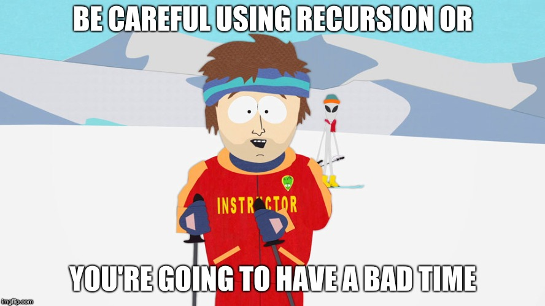

I recently had the task of implementing some retry logic in the project I'm currently working on.

We have a `/register-user` endpoint which does a couple of different API requests to an internal authentication provider and wanted to make it a little more robust in the rare case where a network request could fail, but then succeed a short time later.

I already had a `request` utility function that wraps a `node-fetch` call. This wrapper handles things like standard logging, error handling, and providing some sensible default values for headers. I figured that this was a sensible place to add the retry logic.

The `request` function looks something like this:
```javascript
const fetch = require('node-fetch);

const makeRequest = async () => (
  method, url, data, customOptions
) => {
  const options = {
    method,
    options: {
      ...defaultOptions,
      ...customOptions
    },
    body: data
  }
  const response = await fetch(url, options);
  if (response.status >= 400) {
    // Do some error handling here
  }

  return response;
}

module.exports = { makeRequest };
```

## The retry
A reasonable place to put the retry logic would be in the status check block (`if (status >= 400)`). But what exactly would we do in there? We could make another `fetch` call. But then if that retry failed we'd have to do the same thing and handle that error, and so on.

## Recursion
It's starting to sound like recursion could be helpful here.

Let's see what that might look like:
```javascript
...
const response = await fetch(url, options);
if (response.status >= 400) {
  // Do some error handling here

  // Retry
  // We've added an extra `retryTimes` parameter to this function
  if (response.status >= 500 && retryTimes > 0) {
    // Recursion!
    return makeRequest(
      method,
      url,
      data,
      customOptions,
      { retryTimes: retryTimes - 1 }
    )
  }
}
...
```

Recursion is pretty hard to get your head around sometimes. And it's also kind of dangerous if you're not careful. You always need to make sure to have a **base case**. A base case is a check that ensures that at some point, the function will stop calling itself.

In our example above, the **base case** is when we check `retryTimes > 0`. If that's the case, we want to continue retrying. If that number is down to 0, we know we've run out of retries.

## Conclusion

I don't get a lot of opportunities to use recursion in my day to day work, so I was super excited when I thought of this one. It fit well as a mechanism to retry the same logic again and was quite easy to implement. But remember: **always have a base case** or you're going to have a bad time.
